## Welcome :wave:
<!--
 

       
-->

This is the landing page for my github repository. 
Check out my [homepage](https://djps.github.io) or follow me [@david_sinden](https://twitter.com/david_sinden) / [@davidsinden.bsky.social](https://bsky.app/profile/davidsinden.bsky.social)

</img>

## Currenlty Working On :telescope:

  
Transcranial ultrasound propagation

  For therapy <i>and</i> imaging; using accelerated acoustic and elastic models. 

  
Multibubble dynamics

  <a href="https://github.com/djps/lyapunov">Multibubble dynamics</a>

  
Sparse recovery in acoustic holography

  <a href="https://github.com/djps/MatrixCompletion">Matrix completion</a>

<!--

## Papers :scroll:

* [something](here)

*******

## `whoami`

Places

### 📬 Get in Touch

> * [Bremen](https://en.wikipedia.org/wiki/Bremen) - _Bremen_
> * [Sunbury](https://en.wikipedia.org/wiki/Sunbury-on-Thames) - _Sunbury_
> * [Mile End](https://en.wikipedia.org/wiki/Mile_End) - _East London_

📫 How to reach me: Twitter [@david_sinden](twitter.com/david_sinden)

**djps/djps** is a ✨ _special_ ✨ repository because its `README.md` (this file) appears on your GitHub profile.

Here are some ideas to get you started:

- 🔭 I’m currently working on ...
- 🌱 I’m currently learning ...
- 👯 I’m looking to collaborate on ...
- 🤔 I’m looking for help with ...
- 💬 Ask me about ...
- 📫 How to reach me: Twitter [@david_sinden](twitter.com/david_sinden), GitHub: [github.com/djps](github.com/djps)
- 😄 Pronouns: ...
- ⚡ Fun fact: ...

### 🧰 Languages and Tools

 

---

### 📊 Github Stats 

 

 

-->

